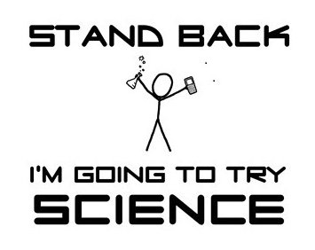

# Approach

We use cognitive modeling and neuroimaging to understand how people learn and make decisions. We are interested how these processes _do, or do not,_ change as people get older. The ultimate goal of this research is to promote health and wellbeing across adulthood.

  

Recognize that this work is inherently interdisciplinary, meaning we will use tools and knowledge from traditional fields like psychology, neuroscience, and economics. Because it requires competency in so many different domains, the learning curve can be steep and can feel overwhelming - but this is also what makes it interesting and rewarding work. Hang in there. It will get easier.  

## Mentorship 

“When you get to the top of the mountain / Pull the next one up.”  - Marc Kelly Smith

This quote, from a poem by Marc Kelly Smith, illustrates my mentorship philosophy. As a mentor, I am here to help you grow as a scientist. Depending on where you are in your career, this can mean different things. For instance, 

* For undergraduate students/post-bacc RAs: This often means helping you decide if science in general, or the cognitive neuroscience of aging and decision making, is the right fit for you. It also means developing skills, like writing, data analysis, and coding, that can be used in many domains. It also means helping you develop foundational knowledge in our research area and whenever possible, helping to connect you to others with shared interests.

* For graduate students: This can mean helping you navigate graduate school, develop a deeper understanding of our research area, grow your advanced research and  project management skills, and improve your writing and oral commiunication. It also means helping you develop a professional network, and create long-term career plan.

* For postdoc trainees: It can mean helping you navigate grantwriting landscape and the academic job search process. It also means helping you broaden your professional network and refine your long-term career plans.

You will be assigned a mentor within the lab. If you are a lab manager, graduate student, or postdoc, the Lab Director will likely be your mentor. If you are an undergraduate, you will likely be reporting to the lab manager, a graduate student, or a postdoc. If you are not sure who your mentor is, ask! It is likely to the person leading the project you are working on.

**Postdocs/PhD Students/Lab Managers** and others leading a project (for instance, a undergraduate working on an honor's thesis) can expect to meet with me regularly (i.e. weekly). The purpose of these meetings is to give you a chance to directly ask me for assistance on the project (or projects) you are working on. *You should come prepared to each meeting with an agenda - you are expected to lead the meeting.* Topics for meetings can include progress reports, questions, new ideas, etc.

Others in the lab will have regular meetings with their assigned mentors.

## Independent Development Plans (IDPs)

To facilitate your grown as a scientist, we will use individual development plans (IDPs). The structure of IDPs will vary depending on your role in the lab, but generally they will set and track short-term and long-term goals. These will be created when you join the lab, shared with your mentor, and be revisited at the beginning of each semester (i.e. Fall, Spring, and Summer). 

__Postdoc/Graduate Students/Post-bacc RAs__

* [Long-Term Plan](https://osf.io/6djsm/)

* [Term Plan](https://osf.io/qfm3r/) 

__Undergraduate Students__

* You will complete the [Expectations](docs/Research_Experience_Expectations.dotx) document when you first join the lab and a copy will be saved by your mentor in the AWL Box folder.

* You will complete the [Letter of Rec](docs/Letter of Recommendation.dotx) document at the beginning of each subsequent semester you work in the laboratory. Copies of these documents will be saved by your mentor in the AWL Box folder.

## Feedback

You should expect to regularly receive feedback from your mentor and your peers. Feedback, especially negative feedback, can be discouraging and overwhelming. Please recognize that the purpose of feedback is to improve your work and help you meet your goals. Also know that giving critical and constructive feedback is an time-consuming effort and **try** to accept feedback in the spirit in which it is offered. As a group, we will discuss how to give and receive feedback.

