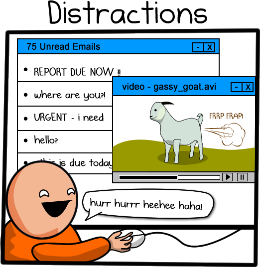
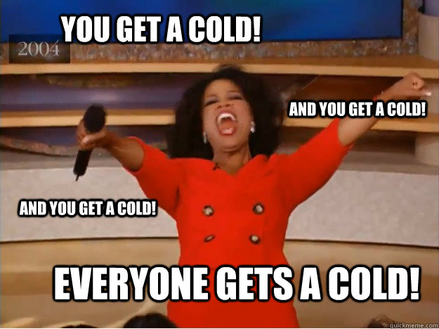
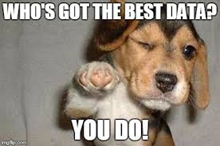
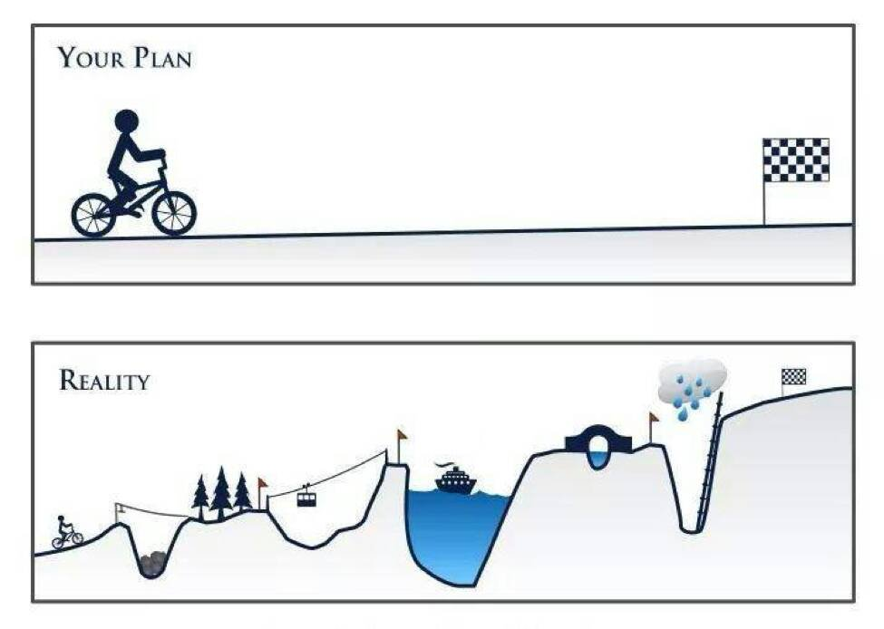
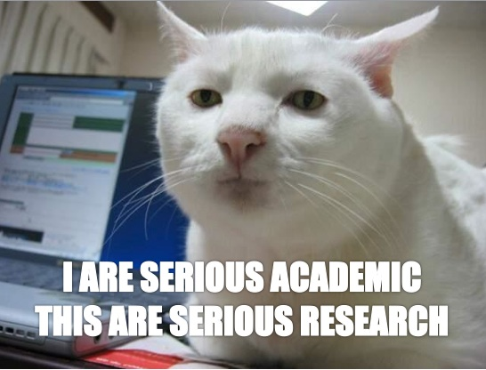
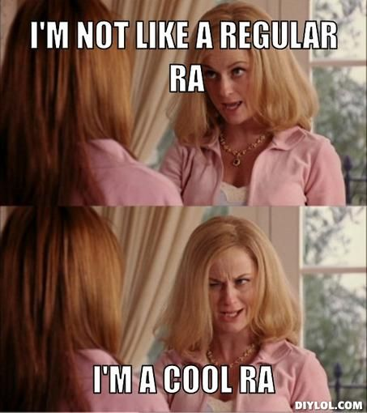

# Expectations and Responsibilities

## Everyone
### Big Picture

We expect everyone to:  

* __Be supportive__ - We're all in this together!  
* __Share your knowledge.__ Mentorship takes many forms, but frequently involves looking out for those who are more junior to us. If you've done something before, share your experience. We are a team and we should work together.
* __Be engaged in the community.__  
     * Attend and actively engage in lab and one-on-one meetings. Ask questions, make suggestions, etc. If you are easily distracted by technology, disconnect during meetings.  
    * Attend talks in the CVL, BBS, and greater UTD community.  
    * Be an positive representative and advocate for our lab and our lab's work in our larger research communities.  
    

  
    
* Be independent when possible, ask for help when necessary. Specifically, ask three, then me!  
     * There are lots of web resources you should consult - StackOverflow, NeuroStars, etc  
     * Use others in the lab (and in the CVL, BBS) and external collaborators.  
* __Communicate honestly__, even when it's difficult.  
* Do work we are proud of individually and as a group.  
    * Double check your work.  
    * Our lab has a commitment to open science. Be ready to share your work both within the lab and with outsides at the conclusion of a project.  

* Work towards proficiency in Unix, BASH, R, and Python. 
* Respect each other's strengths, weaknesses, differences, and beliefs.
     * Be patient with everyone (including the Lab Director). Most of us are learning new skills and are busier than we would like.
* Adhere to the ethical principles as described by the [Association for Psychological Science](https://www.apa.org/ethics/code/), [Society for Neuroscience](https://www.sfn.org/Membership/Professional-Conduct/SfN-Ethics-Policy), and [UT Dallas Responsible Conduct of Research](https://research.utdallas.edu/orio/rcr).
* Maintain a professional and accurate online presence. Make sure you keep your online profiles up to date. Remember, we all represent the lab and the lab represents us.

### Small Picture

We're sharing a relatively small space, so please be thoughtful of others. Specifically:  

* __Do not come into the lab if you are sick!__ It's better to keep everyone healthy. If you are sick, email your mentor and the lab manager.  

* Keep the lab neat. 
     * Do not leave food, drinks, or crumbs in the lab.  
     * Items left unattended may be cleaned, reclaimed or recycled.  

## Lab Director

As the lab director, you can expect me to:  

* Have a vision for where the lab is going, both in the short-term (next few weeks) and in the long-term (next few years).
* Obtain funding to support our laboratory.  
* Care about your happiness.
* Support your career development, including:  
     * writing recommendation letters,  
     * introducing you to other scientists (potential future mentors and colleagues),  
     * promoting your work as often as possible (at conferences),   
     * facilitating conference travel (see position-dependent specifics below), and   
     * working with mentees (Postdocs, Mentees) to create an Individual Development Plan (IDP).  
* Support your personal development, including:  
     * flexible working hours and environment (when feasible), and  
     * encouraging activities outside of school/work.  
* Make the time to meet with you regularly, read and provide feedback on code, posters, manuscripts, and other data products.
* Obsess over chosing the correct analyses, clear phrasing, and awesome data visualizations.

## Employees

Employee salaries follow the [UTD paygrade](https://www.utdallas.edu/hr/compensation/classified/). 

### Lab Manager 

The lab manager is the heart and soul of the lab. While other lab members (including the Lab Director) may have flexible or irregular schedules, the lab manager will be a constant presence for the lab in the Center for Vital Longevity (CVL).

In order to provide constency for the lab, I expect the lab manager to:  

* maintain regularly scheduled hours on weekdays (except for [UTD holidays](https://www.utdallas.edu/hr/news/holidays/)),  
* serve as a liason between the the CVL administrative staff and our lab,  
* check the lab email and personal work email accounts daily and respond to all emails within two business days, and  
* check the voicemail daily and arrange for return calls to be made within one business day.  

The Lab Manager's primary responsibilities include:  

* facilitating the purchase and setup of any new equipment for the lab,  
* coordinating and training all lab research assistants,  
* assisting with the design and implementation of behavioral, eye-tracking, and fMRI experiments,  
* overseeing the recruitment and testing of study participants, and  
* helping with preprocessing and analysis of experimental data.  

### Paid post-bacc Research Assistants 

TBD

### Postdocs and Staff Scientists  

I will expect postdocs and staff scientists to move towards being more PI-like, including:  

* giving conference talks,  
* writing grant proposals, and  
* cultivating an independent research program (up to 10% of time). 

Also, to have (or acquire) the technical and open science skills listed for PhD students below.

Postdoc salaries generally follow [NIH guidelines](https://www.niaid.nih.gov/grants-contracts/salary-cap-and-stipend-levels-announced). 

## Students

### PhD Students

I will expect graduate students to:  

* attend classes, colloquium, and relevant talks around campus,  
* be __excited__ about the research questions they are asking, be __eager__ to find the answers, and __anxious__ to share their results with others,  

* seek out and apply for fellowships and awards (including travel awards), and  
* realize there are times for pulling all-nighters and times for smelling the roses.  

I will expect graduate students to move towards:

* expertise in their chosen field(s) by knowing the literature like the back of their hand (see below for suggestions on how to do this), 
* proficiency in using R and/or Python for data analysis and model fitting,
* writing BASH shell scripts for imaging analysis in FSL, 
* sharing your work with me (and others) using R Markdown and/or Jupyter notebooks,
* preregistering their experiments publicly on OSF, 
* sharing their data and scripts publicly on OSF and/or GitHub, 
* making figures and posters using R or Python along with Adobe Illustrator, 
* clearly communicating your results in written and verbal formats, and 
* actively mentoring those working for them (undergraduate RAs), including completing an Individual Development Plan (IDP).

The learning curve for these skills can be steep, but developing these skills is necessary for success in both cognitive neuroscience and data science. If these goals do not align with your own interests and goals, then my lab is probably not a good fit for you.

### Master's Students

I will expect Master's students to move towards being more PhD student-like. In particular, by the end of their time in the lab, I expect master's students to:  
* complete an empirical study in the lab, and  
* complete a poster and/or written manuscript of that study.  

  

### Undergraduate Students

Undergraduate students will play a vital role in our lab. Students can be involved in the lab in a number of ways, including independent study projects, student works, and internships. Given that we have limited time and resources, unfortunately we cannot accept or keep all undergraduates who are interested in our lab. Based on the lab's needs, we will consider new undergraduates at the beginning of each term. Each new undergraduate must attend a manditory orientation session, journal club, and serve a probationary term (one semester) before advancing further in the lab. 

I expect undergraduates to:  

* commit to work _at least_ 5 hours per week in the lab and maintaining those hours on the lab calendar, 
* show up on time for meetings, lab hours, and testing,  
* make sure all of your work is accurate (double-check everything), and 
* be willing to help with whatever projects need it. 

In most cases, undergraduates will be directly mentored by the lab manager for their first semester in the lab, and then move on to work directly with a research assistant or graduate student. 

