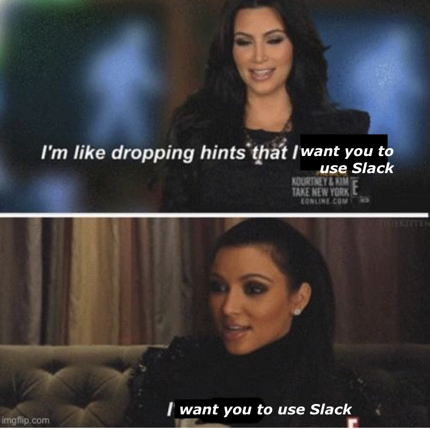
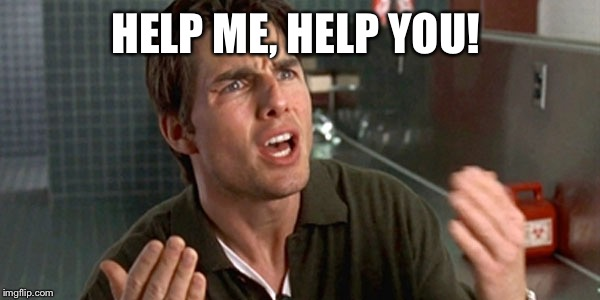

# Communication

Communication is critical. Whether you pursue academia or industry, you will need to be able to communicate with others about your work. We will likely have to go beyond memes in order to do this.

## Lab Meetings

Regular lab meetings are essential for making sure that we move both current and future projects forward. They also help us function as a team. We will use lab meetings to discuss administrative and practical issues, solicit feedback on current analyses and code, discuss current literature, and practice conference and job talks. Our weekly lab meetings will run approximately 1-1.5 hours long. **All full-time staff, graduate students and anyone leading a project** will be expected to attend weekly lab meetings (unless cleared with Dr. Seaman in advance). ***For other lab members (e.g. some undergraduate RAs), attendance at lab meetings will be required at full, bi-weekly lab meetings***.

During lab meetings, one or two presenters will be responsible for setting the agenda that day. The presenter/s will also be responsible for sharing any relevant materials (e.g. journal article) a couple of days in advance. If you're scheduled to present and need to cancel or postpone, please give the group 72 hours notice. **Everyone is expected to participate in lab meetings.** That means reading relevant material beforehand and if you are easily distracted by your computer or phone, put it away.

Generally, attendance at lab meetings in person is expected, unless cleared with Dr. Seaman in advance. There may be times when lab meetings will not occur in person. In these instances, we will have lab meetings online via Zoom. Please consult the lab calendar (see below for link) or lab manager for the Zoom link.

## Individual and Small Group Meetings

All mentors should have weekly meetings with their mentees, lasting between 15 minutes to an hour. For instance, as lab director, I will have weekly meetings with the lab manager, postdocs, staff scientists, and any students leading projects. **Ideally, the agenda for these meetings should be set by the mentee; you should provide a quick overview of the progress you've made on your project and let your mentor know where you're stuck and/or need help.** You can also use individual meetings to seek feedback about new project development or professional development.

## Asana

{width="50%"}

Asana is a project-management platform that we will use to track progress on various projects in the lab.

* Asana is basically an orgnaized to-do list. When adding a task, make sure to put a useful description, assign it to someone and set a tentative due date.\
* Be realistic and flexible with due dates. Of course you should try to get things done in a timely manner, but sometimes, life happens and you have to adjust.\
* If you're leading a project in the lab, please make sure that your project is listed on Asana. All project-related tasks should be under your project.

{width="30%"}

## Slack

{width="50%"}

Slack is a team-collaboration tool that we will use for communication.

* Try to avoid direct messages in Slack. Instead, find a home for your comment or question in an existing channel. This allows you to get answers and feedback from multiple people in the lab.\
* When replying to a question or comment, try to use threads. This keeps the conversation organized and easy to navigate. To reply to a post in a thread, click on the bubble with three horizontal lines in the upper right-hand corner of the message (right next to the reaction button). Checkout [this website](https://slack.com/help/articles/115000769927-Use-threads-to-organize-discussions-) for more info on threads.
* The lab manager, postdocs, and graduate students with UTD phone numbers will have their numbers in their profile on Slack if they need to be urgently contacted.

### For Lab Members Running Sessions

The best way to contact the lab manager regarding your scheduled sessions is through Slack.

* Minor scheduling conflicts need to be brought up at least a week in advance, if possible.
* If you're running late for your session but are on the way, let the lab manager know ASAP!
* Send a message on Slack to the lab manager **and** your project lead if:
    * you have a major change in your weekly schedule.
    * there is an emergency and you're unable to attend your scheduled session on short notice. If neither respond in a timely manner, call the lab manager's number listed in their Slack profile.

## Email

When contacting me, please use Slack (or Asana) whenever possible. I will try to respond to emails, but please don't use it for anything urgent.

Likewise, I will try to use Asana/Slack to communicate with you as much as possible. However, sometimes I will need to email you. **I expect you will read all email sent to you and respond (if a response is needed) within one business day.** If you will not be checking email for more than a couple of days, please consider using a vacation message so that others know you are not available on email (this suggestion also applies to holidays).

The same guideline applies to me: if I don't respond within one business day, please feel free to follow up (but consider using Slack). If I am not available, I will put up a vacation message.

We do have a lab listserve. **Use this sparingly.** To send a message to the listserve, email [cvl.seamanlab\@lists.utdallas.edu](mailto:cvl.seamanlab@lists.utdallas.edu){.email}. If approved, the email will go out to the entire lab.

### Calendars

Our lab manager will maintain a lab calendar, associated with our lab email account. You can access this calendar [here](https://calendar.google.com/calendar/embed?src=agingwelllab%40gmail.com&ctz=America%2FNew_York).

### Phone

* If the phone rings in the lab, answer it. Most calls will be from potential (or current) research participants, so it is important to be professional - e.g., "Aging Well Lab, this is [your name]."

* Lab policy is to check the voicemail daily and call back within one business day.

* Please see the lab wiki for specific on speaking to potential research participants.

## Managing Up

I (Dr. Seaman) need your help to stay organized. If you need me to do somethng for you (e.g. review a pregistration, review code), please create a task in Asana with following information:

* a meaningful title (e.g. review manuscript for Colleen)

* a brief description of what you need (e.g. review the manipulation check on visDM project)

* a deadline, ideally a week from now (e.g. your next one-on-one meeting with me)

* a location of the file/s you want me to review (or attach document if not saved on Box/GitHub)

I typically focus on non-urgent lab-related materials on MWF during the academic year. Please feel free to follow up on Slack; do not send an email.
