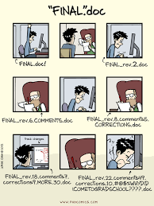

# Scientific Integrity

We have a resposibility to uphold the highest standards of scientific integrity. There is never an excuse for fabricating or misrepresenting data. If you have any questions or  concerns about a research practice you have seen in the lab, please talk to me __immediately.__

## Open Science

The Aging Well Lab has a commitment to open science. This means that we will share all stimuli, data, and analyses online (via OSF) and link these materials to our research publications. In order to make these materials usable to reviewers and other researchers, we will strive to do the following:  

* Document and describe all items. At a minimum, each collection should have a README file at the top level that provides details about the collection.  
* Code should be tested, bug-free, and well-commented.  
* Links should be permanent. 

Lab members creating stimuli or conducting research projects should organize them from the outset in a way that is conducive to eventual sharing (GitHub, ipython notebooks, etc.). More specific guidelines will be posted on the lab wiki (as they will likely change regularly).

### Reproducible Research

Reproducible research is research that can be exactly reproduced - meaning that someone else can get the same results given the same set of data. At a minimum, we want our research to be reproducible.

Conducting reproducible research is more difficult than it sounds, because it requires that you are organized and possess sufficient foresight to document each step of your research process. There are two main things we will do to improve the reproducibility of our research: (1) extensive notetaking and (2) using programming workflows with version control for all research products (including data cleaning, analysis, posters, papers, etc).   

Programming workflows help with reproducibility because they take some of the human element out, and in an ideal scenario, you are left with a script or series of scripts that takes data from raw form to final product. Programming alone is not enough, though, because people can easily forget which script changes they made and when. Therefore, all projects that involve programming of any kind (so basically, all projects) must use some form of version control. 

As a lab, we will use git and GitHub for version control. This is a requirement because (a) it is the only way to track the evolution of methods/files over time, (b) it allows for easier detection of bugs, and (c) it facilitates code sharing. All of these things are directly relevant to conducting reproducible research. More information on GitHub can be found in the General Policies section.

### Preregistration

Pre-registration is specifying a data collection and analysis plan __before__ you gather data. This will allow us to distinguish between what we set out to do, or _confirmatory analyses_ and what we discovered in the process of doing research, or _exploratory_ analyses. See [Preregistration: A Plan, Not a Prison](https://cos.io/blog/preregistration-plan-not-prison/) for more information.

For each study in our lab, we will create a preregistration and repository on OSF (osf.io) using our lab's project template. More information about OSF can be found in the General Policies section.

## Authorship

We will follow [APA guidelines](https://www.apa.org/research/responsible/publication/) with respect to authorship:

"Authorship credit should reflect the individual's contribution to the study. An author is considered anyone involved with initial research design, data collection and analysis, manuscript drafting, and final approval. However, the following do not necessarily qualify for authorship: providing funding or resources, mentorship, or contributing research but not helping with the publication itself. The primary author assumes responsibility for the publication, making sure that the data are accurate, that all deserving authors have been credited, that all authors have given their approval to the final draft; and handles responses to inquiries after the manuscript is published."

Authorship will be discussed prior to the beginning of a new project, so that expectations are clearly defined. However, changes to authorship may occur over the course of a project if a new person becomes involved or if someone is not fulfilling their planned role. In general, I expect that graduate students and postdocs will be first authors on publications on which they are the primary lead, and I will be the last author.

I assume that, unless we have talked about it, I will be an author on papers coming out of the lab. This does not mean that you should add me on to
papers as a courtesy; it means that I expect you to include me in the process
of discussion and writing in a way that merits authorship.

There are many views regarding authorship,and within any view there are always borderline cases. If you ever have any questions, please come speak to me.

### Old Projects

For projects that required significant lab resources (e.g. fMRI studies, behavioral studies, etc), project "ownership" expires 3 years after data collection has ended (or whenever the oroginal primary lead relinquishes their rights to the study, whatever comes first). At that point, I reserve the right to re-assign the project (or not) as needed to expedite publication. This policy is intended to avoid situations in which a data set languishes for a long period of time while still giving publication priority to the original primary lead.

## Human Subjects Research

Because we are engaged in human subjects research, it is imperative that we adhere to our approved IRB protocols. __All lab members must read and comply with the IRB-approved consent form and research summary for any project that they are working on.__ Lab members must also complete [UTD Human Subjects Training](https://research.utdallas.edu/researchers/human-subjects-research/forms-and-resources/training-and-workshops) through eLearning and be added to the research personnel list before they can work with humnan subjects or data. After completing Human Subjects training, the certification of completion must be sent to the lab manager, who is responsible for maintaining these files. If there are any questions about the protocols, or if you're not sure whether we have IRB approval to run your study, please ask the lab manager or me for clarification. If neccessary, the lab manager can file an amendment to an existing protocol or help you create a new protocol.

If you encounter any problems in the course of doing research that results in a negative outcome for the participant (e.g., if a participant becomes ill or upset, if there is an accident with the equipment, if there is a breach of confidentiality, etc), you should __immediately__ seek assistance from me or the lab manager. If I am not around, you __MUST__ notify me within 24 hours, preferably as soon as possible. In some cases, we may need to report this information to the IRB and/or our funding agencies.

