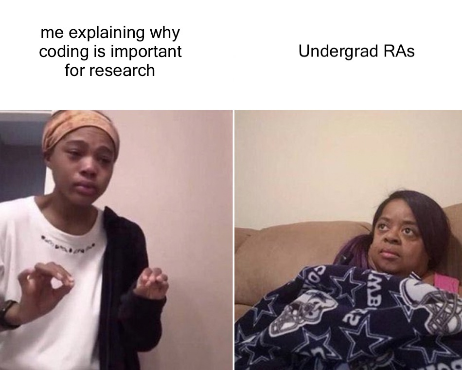
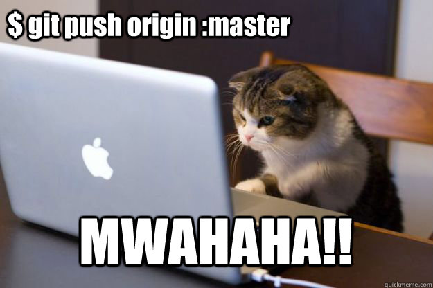
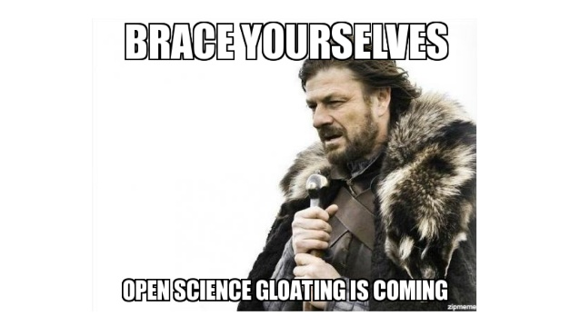

# Data Management

Data are *valuable*, *expensive*, and *crucial* for science. Also, as human subjects researchers, it is critical that we project the privacy of our participants and make sure that we are making the best use of our participants time. Therefore, data management is one of the most important things you will do as a researcher. Further, some of the data our lab works on has been shared with us by collaborators. This data may be protected, have a specific data use agreement, and/or not publicly shared. This means that we have agreed to only use the data for a specific purpose, and using the data beyond the agreed-to purpose is not allowed. 

Thus, there is **no universal access** to data in the Aging Well Lab. You will only have access to the data you need to complete the project or projects for which you are working. If, for any reasons, you need access to some of the lab's unpublished data, please contact Dr. Seaman. She will determine whether access is warranted. Do not use lab data for any purpose other than the project (or projects) we have discussed. If you would like to use lab data for another purpose, please contact Dr. Seaman and she will determine if that use is ok. 

As a lab, we will use a variety of storage mechanisms for data, code, data products, and other lab documents. These include UT Dallas Box, Github, the AWL Lab server (garfield), the UT Dallas HPC (Europa), our lab wiki, and storage space on local computers. **Please do not store lab data on any non-UT Dallas computer or external storage device.**

<center>
{width=60%}
</center>

## Box 

The AWL has a Box account that will be used to store *most* of our work. Because this is a lab account, it is cruical that everyone use the following organizational scheme in this directory.

### Grants

This folder contains general grant resources and _specific_ folders for each grant application. If you are starting a new grant application, create a new folder here for your documents. 

### Institutional Review Board (IRB)

This folder contains documents for all IRB-approved protocols in the lab. In addition to _specific_ folders for each project, there is a folder of sample IRBs and Human Research Certificates).If you are starting a new IRB application, create a new folder here for your documents. Make sure you include a README file specifying the following documents: (1) IRB application and (2) approval letter. If you are using data from another institution, also specify the data use agreement (DUA).  

### Lab Management 

This folder contains documents related to managing the lab. There are separate folders for different aspect of the Lab Manager's duties, including onboarding new members, recruitment for our studies, supply orders, and files relating to our public facing website.

### Measures

This folder contains commonly used measures in the lab. There will be a _specific_ folder for each measure that contains the measure (e.g. Qualtrics files) and scripts to clean and compile the data. Make sure you include a README file describing the contents of your folder.

### Presentations 

This folder contains abstracts and posters/power points for conferences. There is a folder for each conference we regularly attend (e.g. Cognitive Aging Conference, CAC). The contents of each conference folder are organized by year. If you are submitting an abstract to a conference, find (or create) the appropriate conference folder, find (or create) the appropriate year folder, and then create a folder for your own project. If you're creating a new folder, include a README file with general info about the conference and when abstracts are typically due. 

### Projects

This folder contains some data (not neuroimaging) and code for our lab projects. There will be a folder for each project in the lab and it will be organized as described in a section below (Project organization). If you're creating a new folder, include a README file describing the project and folder contents. 

### Tasks
This folder contains commonly used tasks in the lab. There will be a _specific_ folder for each task that contains the task (e.g. PsychoPy scripts, data folders). Make sure you include a README file describing the contents of your folder. When a task is going to be deployed for data collection, a copy will be created in the corresponding "Project" folder.

## GitHub

We will use git and GitHub for version control and collaboration. Thus, all projects in the lab will have a repository (aka "repo") on GitHub. To get started with Git/GitHub, I encourage you to read the [Coding Club's Intro to GitHub](https://ourcodingclub.github.io/2017/02/27/git.html). This is just the beginning; we will dedicate at least one lab meeting to a git/GitHub tutorial each year. There are also several GitHub tutorials linked on the lab website's resource page.

Using GitHub not only allows us to keep track of and work collaboratively on projects, but it also makes it easy to share projects on OSF when they are complete. Because we will ultimately share our GitHub repos with the world, I am going to ask lab members to submit pull requests instead of pushing their changes directly to GitHub. In other words, don't be this cat: 

<center>

</center>

If you don't know what a pull request is, how to push to GitHub, or any of the other jargon I used above, don't worry! We'll discuss all of this during lab meetings throughout the year.

## AWL Local Computer

We will use the local lab computers to store behavioral data current projects. You should create a 'github' directory your computer's desktop or in your home directory. Inside that directory, you should create a folder for each project you are working on in the lab. The folder should be organized as described in the *Data and code organization* section below and it should be version controlled using [git](https://git-scm.com/). This is where you will work on data analysis. As you are working, you will sync this folder with a corresponding repository on GitHub. 

## AWL Lab Server (garfield)

<center>
{width=25%}
</center>

The AWL Lab Server will be used primarily for *computational modeling* and *neuroimaging* projects. Server access will generally be limited to lab staff and graduate students, with some exceptions as necessary. If you need access to the server, contact Dr. Seaman and she will determine whether access is warranted. The server will be used to store data and run computationally-demanding analyses. Thus, we will store only raw and cleaned data and analysis and job scripts in a folder for each project.

### Raw Data
This is the data in its native format and is a READ ONLY folder. For questionnaire data, this is straight from Qualtrics or RedCap. For behavioral data, this is the three files generated by PsychoPy for each participant. For neuroimaging data, these are the DICOM files. 

### Cleaned Data
This folder contains data in a format that is usable. For questionnaire data, this would be a cleaned data file with corresponding data dictionary. For behavioral and/or neuroimaging data, we will use [BIDS format](https://bids.neuroimaging.io/).

### Analysis Scripts
This folder contains analysis scripts. These may be written in r/python for behavioral analysis or unix/python for neuroimaging analysis. All scripts should start with a number that denotes what order the scripts should be run in. Any auxilary scripts should be kept in a subfolder. Ideally, these scripts will be written in a way that thwy can ultimately be shared on github/OSF. 

### Job Scripts
This folder contains the job scripts used to submit a script/set of data as a job.

### Output
This is where the output of any projects will be stored. It can have subfolders to keep output organized. 

## UTD HPC (Europa)

To be developed.

## Project organiztion

To facillitate collaborative work and data sharing, all projects will have a similar file structure. This will also make it easier resume work on a project after a break. Generally, we will save all documents in project folders on the Aging Well Lab Box account and code will be saved in separate git/github repositories. Data will be stored in both locations; the psychopy task will generate a data folder inside of the task folder on Box; this is _raw_ data. Data cleaning scripts will clean and save cleaned data into the _data_ folder in the git/github repository. 

```
project
  |--- administration 
        |--- preregistration.docx
        |--- project_protocol.docx
        |--- project_IC.docx
  |--- manuscript
    |--- 01_PAG
    |--- 02_JGPS
    |--- 03_ANC
      |--- Original Submission
      |--- Revision 1
    |--- figures
    |--- project.docx
    |--- project_preprint.docx
    |--- project_supplement.docx
    |--- project_revcoverletter2.docx
    |--- tables
  |--- task
      |--- data
      |--- stims
```

`project` is the top-level folder and contains all the files for a project. This folder should be renamed for each unique project in a way that indicates what the project is about. It should have the same name as the git/github repository (see below for more information).

`administration` is a folder that contains all administrative files for this project, including the preregistration documents, protocols, and consent forms. 

`manuscript` is a folder that contains all files related to the the manuscript. Inside of this folder will be a number of subfolders, each described below. It will also contain the most up-to-date main manuscript file (project.docx) as well as any preprints, supplements, or cover letters.

Folders that begin with leading numbers (e.g. `01_PAG`, `02_JGPS`, `03_ANC`) represent submission to journals. The version of the manuscript submitted, along with supporting documents (preprints, supplements, cover letters, etc) are moved into these folders when a new journal is selected. In this example, the manuscript was first submitted to _Psychology and Aging_ (PAG), then to _Journals of Gerontology: Psychological Sciences_ (JGPS), and finally to _Aging, Neuropsychology and Cognition_ (ANC). If there are multiple revisions at a journal, the relevant docs are placed inside of folders delineating the `original submission`, `revision 1`, etc.

`figures` is a subfolder under `manuscript` that contains all figures for the manuscript. The files should be clearly named, including the figure number. This folder should also include a file with figure captions.

`tables` is a subfolder under `manuscript` that contains all tables for the manuscript. The files should be clearly named, including the table number. All tables saved here should be in APA format. 

`task` is a folder that contains the psychopy task for the study (if applicable) and all related folder (stimuli, data, etc.)

`data` is a subfolder under `task` that contains the raw data generated by psychopy.

`stims` is a subfolder under `task` that contains any stimuli usind in the psychopy task. 


## Data and code organization

To facillitate collaborative work and data sharing, all projects will have a similar file structure for code as well. This will also make it easier resume work on a project after a break and facilitate recycling of code for other projects. 

```
project 
  |--- 0_get_data.R
  |--- 1_preprocess_data.R
  |--- 2_analyze_data.R
  |--- 3_visualize_data.R
  |--- README.txt
  |--- data
  |--- docs
  |--- figs
  |--- output
  |--- src
```

This  structure is directly stolen from my new favorite blog post, [r best practices](https://kdestasio.github.io/post/r_best_practices/). We will adapt this format as needed for other programming languages.

Code files are stored in the top level of the `project` directory and are named with leading numbers (e.g. `0_get_data.R`) that indicate the order that the scripts should be run in. Also stored in this top-level is a `README.txt` file that contains a description of the project and a brief summary for each folder/file in the project.

`project` is the top-level folder and contains all the files for a project. This folder should be renamed for each unique project in a way that indicates what the project is about.

`data` contains the __cleaned__ data files used in the project. These files __should not be altered__ and are ideally read-only. Each data file should have a corresponding data dictionary that also lives in this folder.

`doc` contains any manuscripts or interm summaries producted with the project.

`figs` contains any plots, images, tables or figures _created and saved by your code_. It should be possible to delete and regenerate this folder with the scripts in the project folder.

`output` contains non-figure objects created by scripts. For instance, processed data or logs.

`scr` contains scripts for small functions you want to `source()` in your scripts. 

### Data and code sharing

<center>
  
</center>

We will use the Open Science Framework (OSF) for organizing and sharing materials related to our projects. This will include preregistrations, code (sourced from GitHub), posters, and preprints. We will share all data and code using repositories on the [Open Science Framework](https://osf.io/) and will share MRI data on [OpenNeuro](https://openneuro.org/). I have created an [AWL project template](https://osf.io/ce8p4/) that you can use when you create a new page for your own project. When you create a new project, just click "More" and search for our template under "Template  (optional)". 

We will publicly share our data/code at the time that we submit projects for publication. While under development, OSF projects should be set to private and shared with your collaborators.

### Code Style

We will use the [tidyverse style guide](https://style.tidyverse.org/) for R and [PEP-8 style guide](https://www.python.org/dev/peps/pep-0008/) for Python. Since we're all new to coding, this will __hopefully__ help us develop good code hygiene (and mitigate the learning of bad  habits).

### Archiving data

This area is TBD.