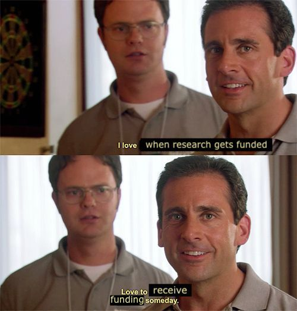

# General Policies

## Hours

One of the benefits of a career in academic research is that it is typically more flexible than other kinds of jobs. However, you should still treat it like a job. If you are employed for 40 hours a week, you should be working 40 hours a week. This applies to lab staff members (the lab manager and other research assistants) and postdocs. You are not required to work over-time. For graduate students, I recognize that you have other demands on your time like classes and TA-ing but still expect to see you in lab, doing research, often.

Lab staff members are expected to keep regular office hours (e.g., somewhere in the ballpark of 9-5). Graduate students and postdocs have more flexibility. 

The lab will observe the official [UTD holidays](https://www.utdallas.edu/hr/news/holidays/). 

### PI Office Hours

In addition to poking my head into the lab regularly, I will be in my office with the door open for at least an hour every day that I'm at CVL (usually Monday, Wednesday, and Friday afternoons). Feel free to interrupt me during that time. If my door is closed, I am likely in a meeting, on the phone, or doing "deep" work. In that case, please send me a message or try me later rather than knock.

## Dress Code

The dress code for lab is relatively casual while working in the lab and having meetings with other members of the lab. However, 
**while running participants and/or interacting with the public**, please wear business casual attire.

## Deadlines

If you need something from me by a particular deadline, please inform me as soon as you are aware of the deadline so that I can allocate my time as efficiently as possible. __I will expect _at least_ one week's notice__, but I greatly prefer two weeks' notice. Please note that this applies to reading/ commenting on abstracts, papers, and manuscripts, in addition to filling out paperwork, etc. __I will require _at least_ two weeks' notice for letters of recommendation.__ If you do not adhere to these guidelines, I may not be able to meet your deadline.

## Recommendation Letters

  

Letters of recommendation are one of the many benefits of working in a research lab. I will write a letter for any student or lab member who has spent at least one year in the lab. Letters will be provided for shorter-term lab members in exceptional circumstances (e.g., new graduate students or postdocs applying for fellowships). I maintain this policy because I do not think that I can adequately evaluate someone who has been around for less than a year.

To request a letter of recommendation, please complete the [Reference/Rec Letter Request](https://docs.google.com/forms/d/1F_NeLFXH7F3mjJD0l_cS1RFaUSOPS_IdfeT4KvJvLgU/edit). Also, please adhere to the deadline requirements described above. In some but not all cases, I may ask you or your lab mentor to draft a letter, which I will then revise to be consistent with my evaluation. This will ensure that I do not miss any details about your work that you think are relevant to the position you're applying for, and it will also help me complete the letter in a timely fashion.

## Data Products (Posters, Presentations, & Papers)

I encourage you to seek out opportunities to present your research to the department, research community, or general public. Any data products for projects from our lab should be discussed with me __before__ an abstract or draft is created or circulated. As lab director, I am responsible for the research coming out of the lab and I need to approve any data products before they leave the laboratory. Remember, all data products from our lab will ultimately be shared on OSF.

### Manuscripts

If you are drafting a manuscript, congratulations! Scientific writing is different from other types of writing, and so you should be prepared to go through multiple rounds of revision. All drafts should be reviewed _and approved_ by your lab mentor before circulating with all co-authors. Once all co-authors have had a chance to read and comment on a draft, we will post a preprint on [bioRxiv](https://www.biorxiv.org/) or [PsyArXiv](https://psyarxiv.com/) and a link to the preprint will be placed on the project's OSF page. _Only after the preprint has been posted will we submit the manuscript for review._

As a lab, we will use the [Peele lab's checklist]( https://github.com/jpeelle/paperchecklist/blob/master/checklist.pdf) to prepare data sets for publication. 

More to come soon!

### Conference Presentations

If you are going to give a presentation (including posters and talks), please be prepared to give a practice presentation to the lab at least one week ahead of time. Not only will this help you feel comfortable with the presentation, it will give you time to implement any feedback. I care about practice presentations because a) presenting your work is a huge part of being successful in science and it's important that you practice those skills as often as possible, and b) you are going to be representing not only yourself but also the rest of the lab.  

More to come soon!  

## Funding

{width=40%}

I will oversee all aspects of the financial management of our funding sources. However, it is important to me to be transparent about where research money comes from and how it's spent. Current funding for the lab comes from my startup package from UT Dallas.

Hopefully we will have NIH funding in the future. When that happens, we will need to comply with federal guidelines. Also, all research funded by the NIH must acknowledge the grant number upon publication. This is essential for documenting that we are turning their money into research findings. We must also submit a yearly progress report describing what we have accomplished. Lab members involved in the research will be asked to contribute to the progress report.

