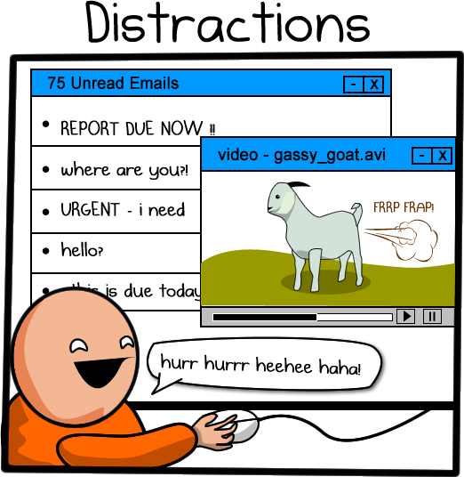
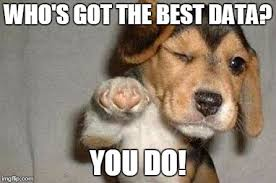
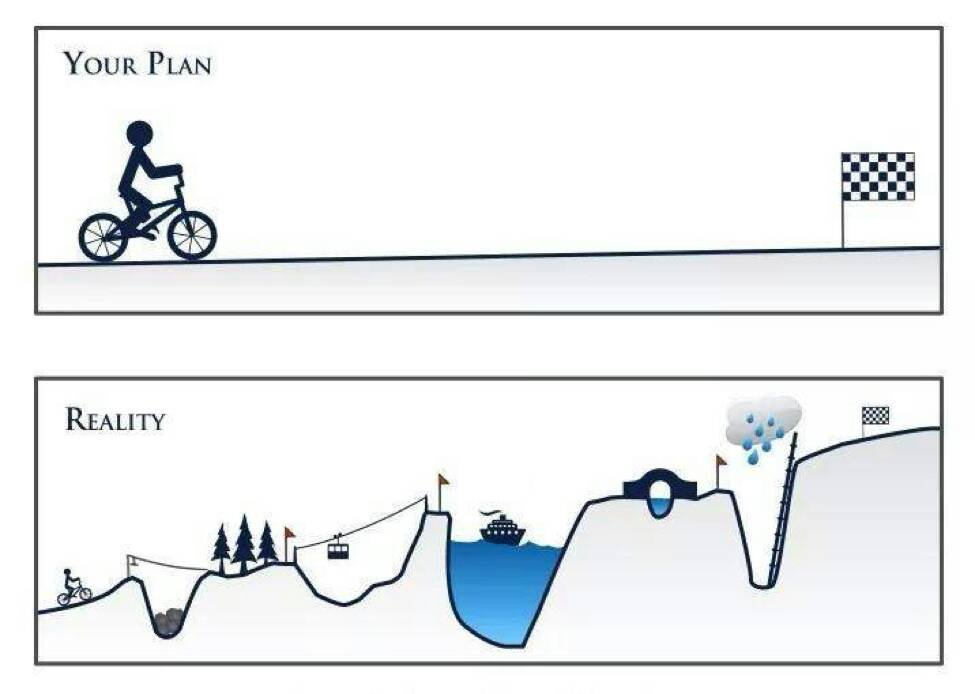
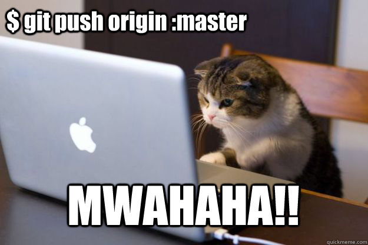

--- 
title: "Aging Well Lab Manual"
author: "Kendra Seaman"
date: "`r Sys.Date()`"
site: bookdown::bookdown_site
output: bookdown::gitbook
documentclass: book
bibliography: [book.bib, packages.bib]
biblio-style: apalike
link-citations: yes
github-repo: rstudio/bookdown-demo
description: "This is the lab manual for the Aging Well Lab at UT Dallas. It is a living document and will be changed as needed."
---

# Introduction

Welcome to the Aging Well Lab manual! This manual was created by the Lab Director, Kendra Seaman, to convey my vision for our lab and to communicate community expectations. This manual will be updated regularly as our lab grows and develops. If you have any comments or suggestions regarding the content of this manual, please share these with me. This is a living document and will change as needed.  

Since we are a brand-new lab, this manual was inspired by (and in some places directly copied from) other lab manuals, including [MemoLab Manual](https://github.com/memobc/memolab-manual), [Peele Lab Manual](http://jpeelle.net/peellelab_manual.pdf), and [Smith Lab Manual](https://github.com/DVSneuro/smithlab_manual/blob/master/SmithLab_manual.pdf). Thanks to everyone who has shared their resources!

This lab manual was created in R Studio using the [bookdown](https://bookdown.org/yihui/bookdown/) package. 

 

## About the Lab

Our research is dedicated to using basic and translational scientific research  to promote health and wellbeing across adulthood. We use a variety of behavioral, modeling and neuroimaging techniques to better understand how the mind and the brain change as people get older.

**Address:**  
Aging Well Laboratory  
Center for Vital Longevity  
1600 Viceroy Drive, Suite 800  
Dallas, TX 75235


## Lab Info

The lab has several public-facing accounts that anyone can access:

* Website: https://agingwelllab.github.io/
* GitHub: https://github.com/agingwelllab
* OSF: https://osf.io/26jqs/  

The lab also has sites that are only accessible to lab members:

* CVL Lab Wiki: https://cvlwiki.utdallas.edu/doku.php?id=seamanlab:home
* Asana: https://app.asana.com
* Slack: https://agingwelllab.slack.com

<!--chapter:end:index.Rmd-->

# Approach

We use cognitive modeling and neuroimaging to understand how people learn and make decisions. We are interested how these processes _do, or do not,_ change as people get older. The ultimate goal of this research is to promote health and wellbeing across adulthood.

<center>
  
</center>

Recognize that this work is inherently interdisciplinary, meaning we will use tools and knowledge from traditional fields like psychology, neuroscience, and economics. Because it requires competency in so many different domains, the learning curve can be steep and can feel overwhelming - but this is also what makes it interesting and rewarding work. Hang in there. It will get easier.  

## Mentorship and IDPs

To help you with this endeavor, you will be assigned a mentor within the lab. If you are a lab manager, graduate student, or postdoc, the Lab Director will likely be your mentor. If you are an undergraduate, you will likely be reporting to the lab manager, a graduate student, or a postdoc. To facilitate these relationships, we will use individual development plans (IDPs). The structure of IDPs will vary depending on your role in the lab, but generally they will set and track short-term and long-term goals. These will be created when you join the lab and be revisited each semester (i.e. Fall, Spring, and Summer).

## Feedback

You should expect to regularly receive feedback from your mentor and your peers. Feedback, especially negative feedback, can be discouraging and overwhelming. Please recognize that the purpose of feedback is to improve your work and help you meet your goals. Also know that giving critical and constructive feedback is an time-consuming effort and **try** to accept feedback in the spirit in which it is offered. As a group, we will discuss how to give and receive feedback.

<center>

</center>


<!--chapter:end:02_Approach.Rmd-->

# Code of Conduct

All lab members are expected to agree with the following code of conduct. We will enforce this code as needed. We expect cooperation with all members to help ensure a safe environment for everyone. Please also see the [UT Dallas Nondiscrimination policy](https://policy.utdallas.edu/utdbp3090).

### The Quick Version

The Aging Well Lab is committed to providing a harrassment-free environment, regardless of gender, gender identity and expression, age, sexual orientation, disability, physical appearance, body size, race, or religion (or lack thereof).  We do not tolerate harrassment of lab members in any form. Sexual language and imagery is generally not appropriate for any lab venue, including lab meetings, presentations, or discussions.

### The Less Quick Version

Harassment includes offensive verbal comments related to gender, gender identity and expression, age, sexual orientation, disability, physical appearance, body size, race, religion, sexual images in public spaces, deliberate intimidation, stalking, following, harassing photography or recording, sustained disruption of talks or other events, inappropriate physical contact, and unwelcome sexual attention.

Members asked to stop any harassing behavior are expected to comply immediately.

If you are being harassed, notice that someone else is being harassed, or have any other concerns, please contact Kendra Seaman immediately. If Kendra is the cause of your concern, then please reach out to one of the center directors or another trusted departmental member who can assist.

We expect members to follow these guidelines at any lab-related event.

This section was adapted from the [MemoLab]( https://github.com/memobc/memolab-manual#code-of-conduct).


<!--chapter:end:03_Code_of_Conduct.Rmd-->

# Expectations and Responsibilities

## Everyone
### Big Picture

We expect everyone to:  

* __Be supportive__ - We're all in this together!  
* __Share your knowledge.__ Mentorship takes many forms, but frequently involves looking out for those who are more junior to us. If you've done something before, share your experience. We are a team and we should work together.
* __Be engaged in the community.__  
     * Attend and actively engage in lab and one-on-one meetings. Ask questions, make suggestions, etc. If you are easily distracted by technology, disconnect during meetings.  
    * Attend talks in the CVL, BBS, and greater UTD community.  
    * Be an positive representative and advocate for our lab and our lab's work in our larger research communities.  
    
<center>

</center>  
    
* Be independent when possible, ask for help when necessary. Specifically, ask three, then me!  
     * There are lots of web resources you should consult - StackOverflow, NeuroStars, etc  
     * Use others in the lab (and in the CVL, BBS) and external collaborators.  
* __Communicate honestly__, even when it's difficult.  
* Do work we are proud of individually and as a group.  
    * Double check your work.  
    * Our lab has a commitment to open science. Be ready to share your work both within the lab and with outsides at the conclusion of a project.  

* Work towards proficiency in Unix, BASH, R, and Python. 
* Respect each other's strengths, weaknesses, differences, and beliefs.
     * Be patient with everyone (including the Lab Director). Most of us are learning new skills and are busier than we would like.
* Adhere to the ethical principles as described by the [Association for Psychological Science](https://www.apa.org/ethics/code/), [Society for Neuroscience](https://www.sfn.org/Membership/Professional-Conduct/SfN-Ethics-Policy), and [UT Dallas Responsible Conduct of Research](https://research.utdallas.edu/orio/rcr).
* Maintain a professional and accurate online presence. Make sure you keep your online profiles up to date. Remember, we all represent the lab and the lab represents us.

### Small Picture

We're sharing a relatively small space, so please be thoughtful of others. Specifically:  

* __Do not come into the lab if you are sick!__ It's better to keep everyone healthy. If you are sick, email your mentor and the lab manager.  

<center>

</center>

* Keep the lab neat. 
     * Do not leave food, drinks, or crumbs in the lab.  
     * Items left unattended may be cleaned, reclaimed or recycled.  

## Lab Director

As the lab director, you can expect me to:  

* Have a vision for where the lab is going, both in the short-term (next few weeks) and in the long-term (next few years).
* Obtain funding to support our laboratory.  
* Care about your happiness.
* Support your career development, including:  
     * writing recommendation letters,  
     * introducing you to other scientists (potential future mentors and colleagues),  
     * promoting your work as often as possible (at conferences),   
     * facilitating conference travel (see position-dependent specifics below), and   
     * working with mentees (Postdocs, Mentees) to create an Individual Development Plan (IDP).  
* Support your personal development, including:  
     * flexible working hours and environment (when feasible), and  
     * encouraging activities outside of school/work.  
* Make the time to meet with you regularly, read and provide feedback on code, posters, manuscripts, and other data products.
* Obsess over chosing the correct analyses, clear phrasing, and awesome data visualizations.

<center>

</center>

## Employees

Employee salaries follow the [UTD paygrade](https://www.utdallas.edu/hr/compensation/classified/). 

### Lab Manager 

The lab manager is the heart and soul of the lab. While other lab members (including the Lab Director) may have flexible or irregular schedules, the lab manager will be a constant presence for the lab in the Center for Vital Longevity (CVL).

In order to provide constency for the lab, I expect the lab manager to:  

* maintain regularly scheduled hours on weekdays (except for [UTD holidays](https://www.utdallas.edu/hr/news/holidays/)),  
* serve as a liason between the the CVL administrative staff and our lab,  
* check the lab email and personal work email accounts daily and respond to all emails within two business days, and  
* check the voicemail daily and arrange for return calls to be made within one business day.  

<center>

</center>

The Lab Manager's primary responsibilities include:  

* facilitating the purchase and setup of any new equipment for the lab,  
* coordinating and training all lab research assistants,  
* assisting with the design and implementation of behavioral, eye-tracking, and fMRI experiments,  
* overseeing the recruitment and testing of study participants, and  
* helping with preprocessing and analysis of experimental data.  

### Paid post-bacc Research Assistants 

TBD

### Postdocs and Staff Scientists  

I will expect postdocs and staff scientists to move towards being more PI-like, including:  

* giving conference talks,  
* writing grant proposals, and  
* cultivating an independent research program (up to 10% of time). 

Also, to have (or acquire) the technical and open science skills listed for PhD students below.

<center>

</center>

Postdoc salaries generally follow [NIH guidelines](https://www.niaid.nih.gov/grants-contracts/salary-cap-and-stipend-levels-announced). 

## Students

### PhD Students

I will expect graduate students to:  

* attend classes, colloquium, and relevant talks around campus,  
* be __excited__ about the research questions they are asking, be __eager__ to find the answers, and __anxious__ to share their results with others,  

<center>

</center>

* seek out and apply for fellowships and awards (including travel awards), and  
* realize there are times for pulling all-nighters and times for smelling the roses.  

I will expect graduate students to move towards:

* expertise in their chosen field(s) by knowing the literature like the back of their hand (see below for suggestions on how to do this), 
* proficiency in using R and/or Python for data analysis and model fitting,
* writing BASH shell scripts for imaging analysis in FSL, 
* sharing your work with me (and others) using R Markdown and/or Jupyter notebooks,
* preregistering their experiments publicly on OSF, 
* sharing their data and scripts publicly on OSF and/or GitHub, 
* making figures and posters using R or Python along with Adobe Illustrator, 
* clearly communicating your results in written and verbal formats, and 
* actively mentoring those working for them (undergraduate RAs), including completing an Individual Development Plan (IDP).

<center>

</center>

The learning curve for these skills can be steep, but developing these skills is necessary for success in both cognitive neuroscience and data science. If these goals do not align with your own interests and goals, then my lab is probably not a good fit for you.

### Master's Students

I will expect Master's students to move towards being more PhD student-like. In particular, by the end of their time in the lab, I expect master's students to:  
* complete an empirical study in the lab, and  
* complete a poster and/or written manuscript of that study.  

<center>
  
</center>

### Undergraduate Students

Undergraduate students will play a vital role in our lab. Students can be involved in the lab in a number of ways, including independent study projects, student works, and internships. Given that we have limited time and resources, unfortunately we cannot accept or keep all undergraduates who are interested in our lab. Based on the lab's needs, we will consider new undergraduates at the beginning of each term. Each new undergraduate must attend a manditory orientation session, journal club, and serve a probationary term (one semester) before advancing further in the lab. 

<center>

</center>

I expect undergraduates to:  

* commit to work _at least_ 5 hours per week in the lab and maintaining those hours on the lab calendar, 
* show up on time for meetings, lab hours, and testing,  
* make sure all of your work is accurate (double-check everything), and 
* be willing to help with whatever projects need it. 

In most cases, undergraduates will be directly mentored by the lab manager for their first semester in the lab, and then move on to work directly with a research assistant or graduate student. 


<!--chapter:end:04_Expectations.Rmd-->

# Communication

<center>

</center>

Communication is critical. Whether you pursue academia or industry, you will need to be able to communicate with others about your work. We will likely have to go beyond memes in order to do this.

## Lab Meetings  

Regular lab meetings are essential for making sure that we move both current and future projects forward. They also help us function as a team. We will use lab meetings to discuss administrative and practical issues, solicit feedback on current analyses and code, discuss current literature, and practice conference and job talks. Our weekly lab meetings will run approximately 1-1.5 hours long. All full-time staff and graduate students will be expected to attend (unless cleared with the Lab Director in advance).  

During lab meetings, one or two presenters will be responsible for setting the agenda that day. The presenter/s will also be responsible for sharing any relevant materials (e.g. journal article) a couple of days in advance. If you're scheduled to present and need to cancel or postpone, please give the group 72 hours notice. __Everyone is expected to participate in lab meetings.__ That means reading relevant material beforehand and if you are easily distracted by your computer or phone, put it away.

<center>

</center>

## Individual Meetings  

All mentors should have weekly meetings with their mentees, lasting between 15 minutes to an hour. For instance, as lab director, I will have weekly meetings with the lab manager, postdocs, staff scientists, and any students leading projects. Ideally, the agenda for these meetings should be set by the mentee; you should provide a quick overview of the progress you've made on your project and let your mentor know where you're stuck and/or need help. You can also use individual meetings to seek feedback about new project development or professional development.

<center>

</center>

## Asana  

Asana is a project-management platform that we will use to track progress on various projects in the lab.  

* Asana is basically an orgnaized to-do list. When adding a task, make sure to put a useful description, assign it to someone and set a tentative due date.  
* Be realistic and flexible with due dates. Of course you should try to get things done in a timely manner, but sometimes, life happens and you have to adjust.  
* If you're leading a project in the lab, please make sure that your project is listed on Asana. All project-related tasks should be under your project.  

<center>
  
</center>

## Slack  

Slack is a team-collaboration tool that we will use for communication.  

* Try to avoid direct messages in Slack. Instead, find a home for your comment or question in an existing channel. This allows you to get answers and feedback from multiple people in the lab.  
* When replying to a question or comment, try to use threads. This keeps the conversation organized and easy to navigate.  

<center>

</center>

## Email

When contacting me, please use Slack (or Asana) whenever possible. I will try to respond to emails, but please don't use it for anything urgent.

<center>

</center>

Likewise, I will try to use Asana/Slack to communicate with you as much as possible. However, sometimes I will need to email you. __I expect you will read all email sent to you and respond (if a response is needed) within one business day.__ If you will not be checking email for more than a couple of days, please consider using a vacation message so that others know you are not available on email (this suggestion also applies to holidays). 

The same guideline applies to me: if I don't respond within one business day, please feel free to follow up (but consider using Slack). If I am not available, I will put up a vacation message.

We do have a lab listserve. __Use this sparingly.__ To send a message to the listserve, email cvl.seamanlab@lists.utdallas.edu. If approved, the email will go out to the entire lab. 

### Calendars

TBD

### Phone

* If the phone rings in the lab, answer it. Most calls will be from potential (or current) research participants, so it is important to be professional - e.g., "Aging Well Lab, this is [your name]. How may I help you?"

* Lab policy is to check the voicemail daily and call back within one business day. 

* Please see the lab wiki for specific on speaking to potential research participants.

<center>
  
</center>


<!--chapter:end:05_Communication.Rmd-->

# Scientific Integrity

We have a resposibility to uphold the highest standards of scientific integrity. There is never an excuse for fabricating or misrepresenting data. If you have any questions or  concerns about a research practice you have seen in the lab, please talk to me __immediately.__

## Open Science

The Aging Well Lab has a commitment to open science. This means that we will share all stimuli, data, and analyses online (via OSF) and link these materials to our research publications. In order to make these materials usable to reviewers and other researchers, we will strive to do the following:  

* Document and describe all items. At a minimum, each collection should have a README file at the top level that provides details about the collection.  
* Code should be tested, bug-free, and well-commented.  
* Links should be permanent. 

Lab members creating stimuli or conducting research projects should organize them from the outset in a way that is conducive to eventual sharing (GitHub, ipython notebooks, etc.). More specific guidelines will be posted on the lab wiki (as they will likely change regularly).

### Reproducible Research

Reproducible research is research that can be exactly reproduced - meaning that someone else can get the same results given the same set of data. At a minimum, we want our research to be reproducible.

Conducting reproducible research is more difficult than it sounds, because it requires that you are organized and possess sufficient foresight to document each step of your research process. There are two main things we will do to improve the reproducibility of our research: (1) extensive notetaking and (2) using programming workflows with version control for all research products (including data cleaning, analysis, posters, papers, etc).   

Programming workflows help with reproducibility because they take some of the human element out, and in an ideal scenario, you are left with a script or series of scripts that takes data from raw form to final product. Programming alone is not enough, though, because people can easily forget which script changes they made and when. Therefore, all projects that involve programming of any kind (so basically, all projects) must use some form of version control. 

<center>

</center>

As a lab, we will use git and GitHub for version control. This is a requirement because (a) it is the only way to track the evolution of methods/files over time, (b) it allows for easier detection of bugs, and (c) it facilitates code sharing. All of these things are directly relevant to conducting reproducible research. More information on GitHub can be found in the General Policies section.

### Preregistration

Pre-registration is specifying a data collection and analysis plan __before__ you gather data. This will allow us to distinguish between what we set out to do, or _confirmatory analyses_ and what we discovered in the process of doing research, or _exploratory_ analyses. See [Preregistration: A Plan, Not a Prison](https://cos.io/blog/preregistration-plan-not-prison/) for more information.

For each study in our lab, we will create a preregistration and repository on OSF (osf.io) using our lab's project template. More information about OSF can be found in the General Policies section.

## Authorship

We will follow [APA guidelines](https://www.apa.org/research/responsible/publication/) with respect to authorship:

"Authorship credit should reflect the individual's contribution to the study. An author is considered anyone involved with initial research design, data collection and analysis, manuscript drafting, and final approval. However, the following do not necessarily qualify for authorship: providing funding or resources, mentorship, or contributing research but not helping with the publication itself. The primary author assumes responsibility for the publication, making sure that the data are accurate, that all deserving authors have been credited, that all authors have given their approval to the final draft; and handles responses to inquiries after the manuscript is published."

Authorship will be discussed prior to the beginning of a new project, so that expectations are clearly defined. However, changes to authorship may occur over the course of a project if a new person becomes involved or if someone is not fulfilling their planned role. In general, I expect that graduate students and postdocs will be first authors on publications on which they are the primary lead, and I will be the last author.

I assume that, unless we have talked about it, I will be an author on papers coming out of the lab. This does not mean that you should add me on to
papers as a courtesy; it means that I expect you to include me in the process
of discussion and writing in a way that merits authorship.

There are many views regarding authorship,and within any view there are always borderline cases. If you ever have any questions, please come speak to me.

### Old Projects

For projects that required significant lab resources (e.g. fMRI studies, behavioral studies, etc), project "ownership" expires 3 years after data collection has ended (or whenever the oroginal primary lead relinquishes their rights to the study, whatever comes first). At that point, I reserve the right to re-assign the project (or not) as needed to expedite publication. This policy is intended to avoid situations in which a data set languishes for a long period of time while still giving publication priority to the original primary lead.

## Human Subjects Research

Because we are engaged in human subjects research, it is imperative that we adhere to our approved IRB protocols. __All lab members must read and comply with the IRB-approved consent form and research summary for any project that they are working on.__ Lab members must also complete [UTD Human Subjects Training](https://research.utdallas.edu/researchers/human-subjects-research/forms-and-resources/training-and-workshops) through eLearning and be added to the research personnel list before they can work with humnan subjects or data. After completing Human Subjects training, the certification of completion must be sent to the lab manager, who is responsible for maintaining these files. If there are any questions about the protocols, or if you're not sure whether we have IRB approval to run your study, please ask the lab manager or me for clarification. If neccessary, the lab manager can file an amendment to an existing protocol or help you create a new protocol.

<center>

</center>

If you encounter any problems in the course of doing research that results in a negative outcome for the participant (e.g., if a participant becomes ill or upset, if there is an accident with the equipment, if there is a breach of confidentiality, etc), you should __immediately__ seek assistance from me or the lab manager. If I am not around, you __MUST__ notify me within 24 hours, preferably as soon as possible. In some cases, we may need to report this information to the IRB and/or our funding agencies.


<!--chapter:end:06_Scientific_Integrity.Rmd-->

# General Policies

## Hours

One of the benefits of a career in academic research is that it is typically more flexible than other kinds of jobs. However, you should still treat it like a job. If you are employed for 40 hours a week, you should be working 40 hours a week. This applies to lab staff members (the lab manager and other research assistants) and postdocs. You are not required to work over-time. For graduate students, I recognize that you have other demands on your time like classes and TA-ing but still expect to see you in lab, doing research, often.

Lab staff members are expected to keep regular office hours (e.g., somewhere in the ballpark of 9-5). Graduate students and postdocs have more flexibility. 

### PI Office Hours

In addition to poking my head into the lab regularly, I will be in my office with the door open for at least an hour every day that I'm at CVL (usually Mondays, Wednesdays, and Fridays). Feel free to interrupt me during that time. If my door is closed, I am likely in a meeting, on the phone, or doing "deep" work. In that case, please send me a message or try me later rather than knock.

## Deadlines

If you need something from me by a particular deadline, please inform me as soon as you are aware of the deadline so that I can allocate my time as efficiently as possible. __I will expect _at least_ one week's notice__, but I greatly prefer two weeks' notice. Please note that this applies to reading/ commenting on abstracts, papers, and manuscripts, in addition to filling out paperwork, etc. __I will require _at least_ two weeks' notice for letters of recommendation.__ If you do not adhere to these guidelines, I may not be able to meet your deadline.

## Recommendation Letters

<center>
  
</center>

Letters of recommendation are one of the many benefits of working in a research lab. I will write a letter for any student or lab member who has spent at least one year in the lab. Letters will be provided for shorter-term lab members in exceptional circumstances (e.g., new graduate students or postdocs applying for fellowships). I maintain this policy because I do not think that I can adequately evaluate someone who has been around for less than a year.

To request a letter of recommendation, please complete the [Reference/Rec Letter Request](https://docs.google.com/forms/d/1F_NeLFXH7F3mjJD0l_cS1RFaUSOPS_IdfeT4KvJvLgU/edit). Also, please adhere to the deadline requirements described above. In some but not all cases, I may ask you or your lab mentor to draft a letter, which I will then revise to be consistent with my evaluation. This will ensure that I do not miss any details about your work that you think are relevant to the position you're applying for, and it will also help me complete the letter in a timely fashion.

## Data Products (Posters, Presentations, & Papers)

I encourage you to seek out opportunities to present your research to the department, research community, or general public. Any data products for projects from our lab should be discussed with me __before__ an abstract or draft is created or circulated. As lab director, I am responsible for the research coming out of the lab and I need to approve any data products before they leave the laboratory. Remember, all data products from our lab will ultimately be shared on OSF.

### Manuscripts

If you are drafting a manuscript, congratulations! Scientific writing is different from other types of writing, and so you should be prepared to go through multiple rounds of revision. All drafts should be reviewed _and approved_ by your lab mentor before circulating with all co-authors. Once all co-authors have had a chance to read and comment on a draft, we will post a preprint on [bioRxiv](https://www.biorxiv.org/) or [PsyArXiv](https://psyarxiv.com/) and a link to the preprint will be placed on the project's OSF page. _Only after the preprint has been posted will we submit the manuscript for review._

As a lab, we will use the [Peele lab's checklist]( https://github.com/jpeelle/paperchecklist/blob/master/checklist.pdf) to prepare data sets for publication. 

More to come soon!

### Conference Presentations

If you are going to give a presentation (including posters and talks), please be prepared to give a practice presentation to the lab at least one week ahead of time. Not only will this help you feel comfortable with the presentation, it will give you time to implement any feedback. I care about practice presentations because a) presenting your work is a huge part of being successful in science and it's important that you practice those skills as often as possible, and b) you are going to be representing not only yourself but also the rest of the lab.  

More to come soon!  

<center>

</center>  

## Data management

This section is still in development. 

## Box 

The AWL has a Box account that will be used to store *most* of our work. Because this is a lab account, it is cruical that everyone use the following organizational scheme in this directory.

### Grants

This folder contains general grant resources and _specific_ folders for each grant application. If you are starting a new grant application, create a new folder here for your documents. 

### Institutional Review Board (IRB)

This folder contains documents for all IRB-approved protocols in the lab. In addition to _specific_ folders for each project, there is a folder of sample IRBs and Human Research Certificates).If you are starting a new IRB application, create a new folder here for your documents. Make sure you include a README file specifying the following documents: (1) IRB application and (2) approval letter. If you are using data from another institution, also specify the data use agreement (DUA).  

### Lab Management 

This folder contains documents related to lab manager. 

### Measures

This folder contains commonly used measures in the lab. There will be a _specific_ folder for each measure that contains the measure (e.g. Qualtrics or PsychoPy folder) and scripts to clean and compile the data. Make sure you include a README file describing the contents of your folder.

### Presentations 

This folder contains abstracts and posters/power points for conferences. There is a folder for each conference we regularly attend (e.g. Cognitive Aging Conference, CAC). The contents of each conference folder are organized by year. If you are submitting an abstract to a conference, find (or create) the appropriate conference folder, find (or create) the appropriate year folder, and then create a folder for your own project. If you're creating a new folder, include a README file with general info about the conference and when abstracts are typically due. 

### Projects

This folder contains some data (not neuroimaging) and code for our lab projects. There will be a folder for each project in the lab and it will be organized as described in the following section (Data and code organization). If you're creating a new folder, include a README file describing the project and folder contents. 

### Data and code organization

To facillitate collaborative work and data sharing, all projects will have a similar file structure. This will also make it easier resume work on a project after a break and facilitate recycling of code for other projects.

```
project 
  |--- 0_get_data.R
  |--- 1_preprocess_data.R
  |--- 2_analyze_data.R
  |--- 3_visualize_data.R
  |--- README.txt
  |--- data
  |--- docs
  |--- figs
  |--- output
  |--- src
```

This  structure is directly stolen from my new favorite blog post, [r best practices](https://kdestasio.github.io/post/r_best_practices/). We will adapt this format as needed for other programming languages.

Code files are stored in the top level of the `project` directory and are named with leading numbers (e.g. `0_get_data.R`) that indicate the order that the scripts should be run in. Also stored in this top-level is a `README.txt` file that contains a description of the project and a brief summary for each folder/file in the project.

`project` is the top-level folder and contains all the files for a project. This folder should be renamed for each unique project in a way that indicates what the project is about.

`data` contains the _raw_ data files used in the project. These files __should not be altered__ and are ideally read-only. Each data file should have a corresponding data dictionary that also lives in this folder.

`doc` contains any manuscripts or interm summaries producted with the project.

`figs` contains any plots, images, tables or figures _created and saved by your code_. It should be possible to delete and regenerate this folder with the scripts in the project folder.

`output` contains non-figure objects created by scripts. For instance, processed data or logs.

`scr` contains scripts for small functions you want to `source()` in your scripts. 

### Data and code sharing

<center>
  
</center>

We will use the Open Science Framework (OSF) for organizing and sharing materials related to our projects. This will include preregistrations, code (sourced from GitHub), posters, and preprints. We will share all data and code using repositories on the [Open Science Framework](https://osf.io/) and will share MRI data on [OpenNeuro](https://openneuro.org/). I have created an [AWL project template](https://osf.io/ce8p4/) that you can use when you create a new page for your own project. When you create a new project, just click "More" and search for our template under "Template  (optional)".

### GitHub

We will use git and GitHub for version control and collaboration. Thus, all projects in the lab will have a repository (aka "repo") on GitHub. To get started with Git/GitHub, I encourage you to read the [Coding Club's Intro to GitHub](https://ourcodingclub.github.io/2017/02/27/git.html). This is just the beginning; we will dedicate at least one lab meeting to a git/GitHub tutorial each year. There are also several GitHub tutorials linked on the lab website's resource page.

Using GitHub not only allows us to keep track of and work collaboratively on projects, but it also makes it easy to share projects on OSF when they are complete. Because we will ultimately share our GitHub repos with the world, I am going to ask lab members to submit pull requests instead of pushing their changes directly to GitHub. In other words, don't be this cat: 

<center>

</center>

If you don't know what a pull request is, how to push to GitHub, or any of the other jargon I used above, don't worry! We'll discuss all of this during lab meetings throughout the year.

### Code Style

We will use the [tidyverse style guide](https://style.tidyverse.org/) for R and [PEP-8 style guide](https://www.python.org/dev/peps/pep-0008/) for Python. Since we're all new to coding, this will __hopefully__ help us develop good code hygiene (and mitigate the learning of bad  habits).

### Archiving data

This area is TBD.

## Funding

I will oversee all aspects of the financial management of our funding sources. However, it is important to me to be transparent about where research money comes from and how it's spent. Current funding for the lab comes from my startup package from UT Dallas. 

Hopefully we will have NIH funding in the future. When that happens, we will need to comply with federal guidelines. Also, all research funded by the NIH must acknowledge the grant number upon publication. This is essential for documenting that we are turning their money into research findings. We must also submit a yearly progress report describing what we have accomplished. Lab members involved in the research will be asked to contribute to the progress report.


<!--chapter:end:07_General_Policies.Rmd-->

# Resources

## Glossary

__Individual Development Plan (IDP)__ - a tool to assist mentees in academic and career development. 

__Institutional Review Board (IRB)__ - committees at US research institutions that review and approve research proposals to ensure they are ethical.


__Version Control__ - a system that records changes to a file (or set of files) over time so that you can recall specific versions later.

## Links

__Open Science Framework (OSF)__ - a tool developed and maintained by the Center for Open Science for creating, organizing, developing, and sharing research projects - https://osf.io/

__OpenNeuro__ - a repository for sharing neuroimaging data - https://openneuro.org/

__StackOverflow__ - open community for troubleshooting any kind of code -  https://stackoverflow.com/

__Neurostars__ - a listserve for neuroimaging questions - https://neurostars.org/

__GitHub__ - a respository for code - https://github.com/

__bioRxiv__ - a preprint server for biological sciences; we will post our more neuroscience-y work here - https://www.biorxiv.org/

__PsyArXiv__ - a preprint server for psychological sciences; we will post our behavioral studies here - https://psyarxiv.com/

__Peele Lab's Manuscript Checklist__ - a checklist of things to do before submitting a manuscript to ensure open access - https://github.com/jpeelle/paperchecklist

<!--chapter:end:08_Resources.Rmd-->

